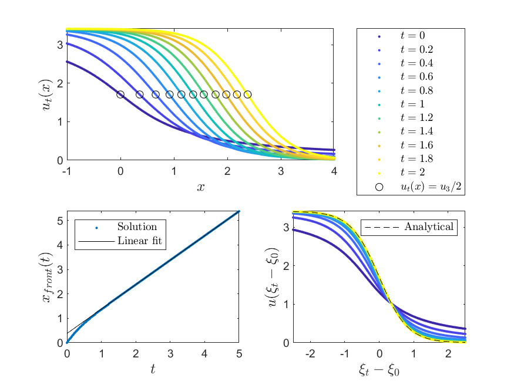
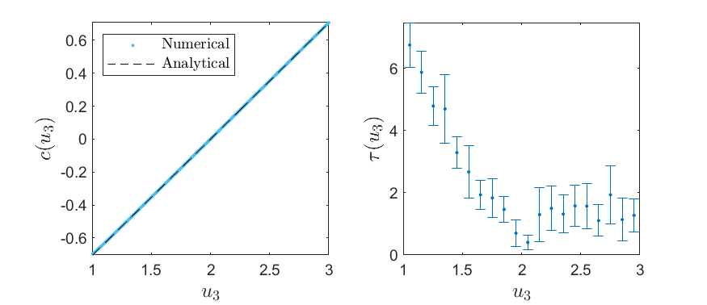

# Time-Dependent Ginzburg-Landau Equation - Traveling Front

In this work, basic simulations and analysis are carried out of a certain traveling-front case of the 1-dimensional Time-Dependent Ginzburg-Landau Equation (TDGLE). This equation is a PDE that involves diffusion and an additional reaction(s), and is given by
```math
\frac{\partial u}{\partial t} = D\frac{\partial^2 u}{\partial x^2}+f(u)    \quad ,
```
where $u(x,t)$ can be regarded as a particle density, $D$ is the diffusion coefficient and $f(u)$ is the reaction function, which describes additionl, density-dependent effects in the system.
Specifically, the TDGLE involves a *bistable* reaction function, which in itself has two stable fixed points, introducing two stable phases to which the solution tends at long times, under certain limitations. 
Here, a generic cubic reaction function is considered, namely $f(u)=-k(u-u_1)(u-u_2)(u-u_3)$ for $k>0$ and $u_1 < u_2 < u_3$).

Due to the fact that there are two stable phases in the infinite problem, a competition between the two can be generated by feeding the equation with initial conditions that have certain properties, which then creates traveling-front dynamics, such that the solution is of the form $u(x,t)=u(x-ct)$ for some velocity $c$. Subsequently, one of the phases eventually takes over as $t\to\infty$, depending on the sign of $c$. The asymptotic form and velocity of the traveling front are compared with the theoretical predictions, and the invariance of the asymptotic front to initial conditions is demonstrated. In addition, both the dependencies of the wave velocity and convergence time on the reaction function are characterized. 

The dynamics were numerically solved for using *MATLAB*'s built-in PDE solver `pdepe` solver, which discretizes space and integrates the ODEs resulting from this spatial discretization to obtain the approximate solutions at the desired times.

For a full account of the simulations and analysis, including a more rigorous and detailed account of the analytical process and intuition behind the equation, take a look at the [*included paper*](Time_Dependent_Ginzburg_Landau_Equation___Traveling_Front.pdf).


## Code

> [!NOTE]
> **For a script-specific description, check each script directly.**

* In [`simulations.m`](Code/simulations.m) you can find the general simulation scheme, which implements all 3 different simulations, and plots the relevant figures.

* Both [`pdefun.m`](Code/pdefun.m) and [`bcfun.m`](Code/bcfun.m) are used by `pdepe` as function handles to solve for the dynamics, defining the PDE and the boundary conditions respectively.

* [`fit_front.m`](Code/fit_front.m) fits the dynamics of the traveling front, returning the asymptotic wavefront velocity and convergence time of the front to the fit.


## Data and Plots

Both the relavant data from the simulations and the corresponding figures shown in the [*included paper*](Time_Dependent_Ginzburg_Landau_Equation___Traveling_Front.pdf) are included in the [*Data_&_Plots*](Data_&_Plots/) directory.

Here are 2 figures:

<figure>
   
   <figcaption> Dynamics of the TDGLE, computing the velocity c of the traveling front </figcaption>
</figure>

<figure>
   
   <figcaption> Area rule (i.e. Maxwell’s rule) and convergence times </figcaption>
</figure>

